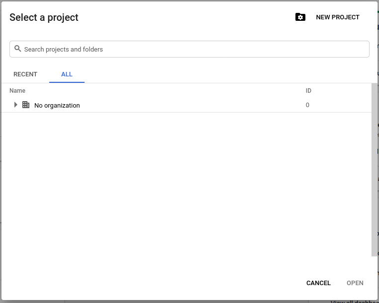
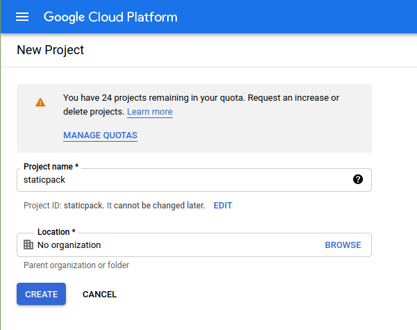
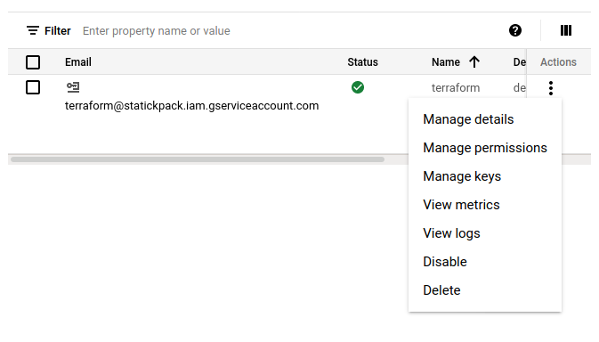
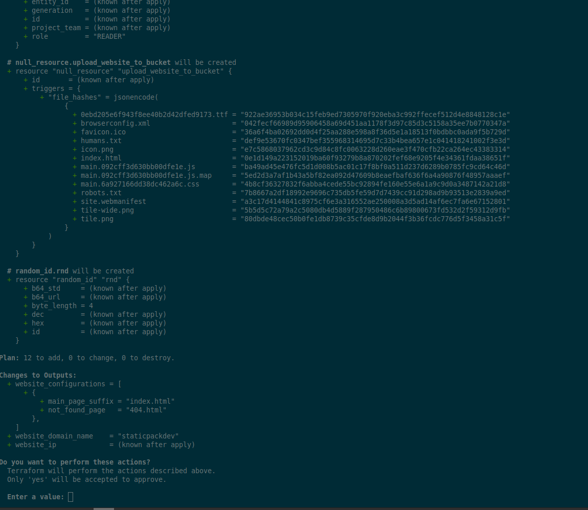

# GCP Deployment Configurations Guide

This is a guide to configure a Google Cloud environment to be able to deploy a static website in a bucket. The static website work with HTTPS.
First, you have to enable a Google Cloud account and configure a [billing account](https://cloud.google.com/billing/docs/how-to/modify-project).

> **Note**: this guide will help you to launch the deployment from localhost. You can follow this guide and adapt it to use a continuous delivery system if you need to.

## Step 1: create a project

* [Create a new project]("https://cloud.google.com/resource-manager/docs/creating-managing-projects") for your website:



* Add a name and an organization (optional):



Your project is initialized, we will configure a service account attached to this project to deploy the website.

## Step 2: create a service account

You need to [create a dedicated service account](https://cloud.google.com/iam/docs/creating-managing-service-accounts) for terraform to add IAM rules and limit the right to the minimum.

* create a new service account for your project in `IAM > Services Account > Create Service Account`
* add dedicated roles to permit terraform to create the elements for website deployment:
  * Compute Load Balancer Admin
  * DNS Administrator
  * Storage Admin
  
Be sure to enable `Cloud DNS API` and `Compute Engine API` for your project, terraform will use these APIs.
Next, you have to generate a credentials key associated to this service account.

## Step 3: create the credentials key

You need a credentials key as a JSON file to use the terraform module.
To create it, just click on the menu on your service account and click `manage keys`:



Add a new key by clicking on `Add key` and choose `JSON`, the cloud create the key and you can download it.

> **WARNING**: this key is an authentication key, you have to store it securely because it gives access to your cloud account.

Finally, we will configure the module and deploy the website.

## Step 4: configure the inputs and deploy the website

First, be sure to own a domain, if you don't have any domain you can have one on [Google Domain](https://domains.google/).
The domain should be [validated by GCP](https://cloud.google.com/storage/docs/domain-name-verification#verification). Note the service account you created earlier should be an [owner of your domain](https://cloud.google.com/storage/docs/domain-name-verification#additional_verified_owners).

We need to configure the environment variables to add the inputs for the terraform module.
First, you can copy the configs.env.dist file:

```shell
cp configs.env.dist configs.env
```

Now open the `configs.env` file and you can see the inputs:

* `TF_VAR_authkey`: the name of the json credentials key.
* `TF_VAR_domain`: the domain name you use for the website.
* `TF_VAR_gcp_project_id`: the identifier of the GCP project, go to the project dashboard to have it.
* `TF_VAR_dist`: the dist path containing the production assets to deploy. There is no need to update this one.

Copy / paste the credentials JSON file in `deploy/gcp/` folder and update the config.env file.

> **WARNING**: staticpack is a git repository. NEVER commit some secret or credentials into a git repository.

Finally, you can launch the final deployment:
```shell
make gcp-deploy
```

After the docker image build and the terraform init, it will plan the deployment:



if the plan is correct type `yes` to apply the deployment.

## Note on destroy

If you need to disconnect the website from production, destroy the resources and clean your GCP environment, just type:

```shell
make gcp-destroy
```

After confirmation, terraform will delete the website from GCP and destroy all resources.

> **WARNING**: if you confirm the destroy operation the website will be offline and all resources will be lost.
